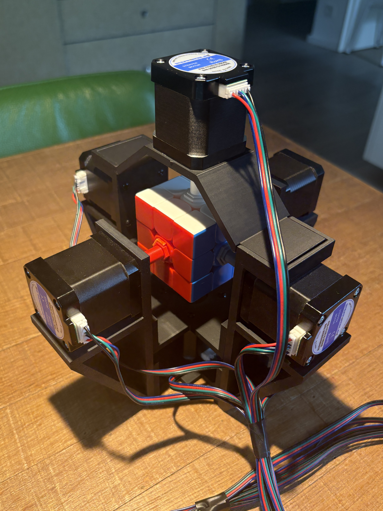
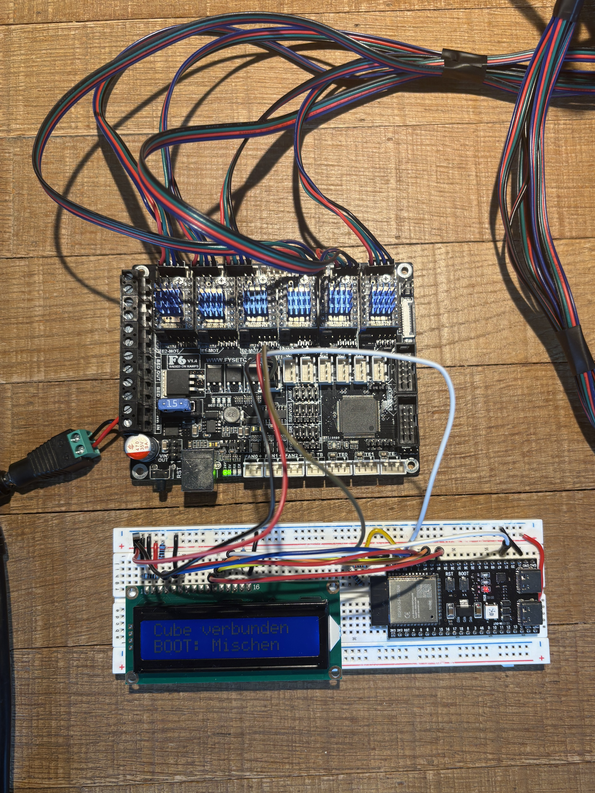

# Rubik's Cube Robot

This robot solves a Rubik's Cube automatically. An ESP32-S3 reads the state of
a QiYi QYSC-S Rubiks Cube via Bluetooth and calculates a solution using the min2phase
algorithm. A FYSETC F6 then controls six stepper motors that turn the cube.

## Demo

Current record: **0.902 s**

<div align="center">

https://github.com/user-attachments/assets/f63d3622-d1c3-4cb1-b660-a3a5f470cd66

</div>

## Features

- Cube state detection via Bluetooth
- Solution calculation directly on the ESP32-S3
- Six individually controlled NEMA 17 stepper motors
- Parallel movement of opposite cube faces
- Status, progress, and time display on an LCD1602
- Ability to abort an ongoing movement
- Individual tests for motors, TMC UART, and the connection between both controllers

## How It Works

1. The ESP32-S3 connects to the QiYi cube via Bluetooth.
2. The current cube state is read and verified.
3. The min2phase solver calculates and evaluates suitable move sequences.
4. The ESP32 sends the selected move sequence to the FYSETC F6 via UART.
5. The F6 generates the STEP/DIR signals for the six TMC2209 motor drivers.
6. After the movement, the ESP32 verifies the cube's new state.

## Hardware

The build consists of an ESP32-S3, a FYSETC F6, six TMC2209 motor drivers,
six NEMA 17 stepper motors, an LCD1602, and a QiYi QYSC-S. The complete list is
available in the [component list](docs/HARDWARE.md).

| Robot | Control electronics |
|:---:|:---:|
|  |  |

## Software

The firmware consists of two programs:

- [`esp32_cube_controller`](Code/robot/esp32_cube_controller/): Bluetooth,
  state verification, solver, LCD, and communication with the F6
- [`f6_motion_controller`](Code/robot/f6_motion_controller/): motor driver
  configuration and execution of the calculated cube moves

The complete connections are described in the
[wiring instructions](Code/robot/WIRING.md). Operation and configured motion
values are covered by the [robot documentation](Code/robot/README.md).

## Building the Robot

1. Print the parts in [`3D Model`](3D%20Model/).
2. Mechanically assemble the motors, adapters, frame, and cube.
3. Connect the ESP32-S3, LCD1602, FYSETC F6, and motor drivers according to the
   [wiring instructions](Code/robot/WIRING.md).
4. First, test the individual components with the programs in
   [`Code/tests`](Code/tests/).
5. Then upload the two programs in [`Code/robot`](Code/robot/).

The Arduino settings and upload instructions are provided in the README files
of the respective firmware directories.

## Tests

[`Code/tests`](Code/tests/) contains separate programs for:

- the UART connection to a TMC2209
- moving a single motor
- the UART connection between the ESP32-S3 and FYSETC F6
- checking the direction of rotation of all six motors

## Project Structure

```text
Code/
  robot/    Production firmware for ESP32-S3 and FYSETC F6
  tests/    Programs for commissioning and troubleshooting
docs/       Component list
3D Model/   Print-ready STL files
```

## Notes

- Only connect or disconnect motors and motor drivers when the 24 V supply is
  switched off.
- Check the driver orientation and current limit before switching on the power.
- The F6's 5 V TX output may only be connected to the ESP32's 3.3 V RX input
  through the [documented voltage divider](Code/robot/WIRING.md#esp32-s3-to-fysetc-f6).
- License notices for the solver and QiYi protocol are included with the
  ESP32 firmware.
